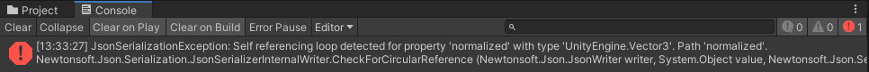
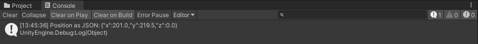

# Unity Converters for Newtonsoft.Json

[](https://openupm.com/packages/jillejr.newtonsoft.json-for-unity.converters/)
[](https://circleci.com/gh/applejag/Newtonsoft.Json-for-Unity.Converters)
[](https://www.codacy.com/manual/jilleJr/Newtonsoft.Json-for-Unity.Converters?utm_source=github.com&amp;utm_medium=referral&amp;utm_content=jilleJr/Newtonsoft.Json-for-Unity.Converters&amp;utm_campaign=Badge_Grade)
[](/CODE_OF_CONDUCT.md)

This package contains converters to and from common Unity types. Types such as
**Vector2, Vector3, Matrix4x4, Quaternions, Color, even ScriptableObject,**
*and many, many more.*
(See the [full compatibility table of all +50 supported Unity types][doc-compatability-table])

## Dependencies

### Newtonsoft.Json packages

This package requires the `Newtonsoft.Json.dll` file to be present in your
project. So it **does not have to be used with my
`jillejr.newtonsoft.json-for-unity` package!** I recognize that there are too
many Newtonsoft.Json forks and variants out there in the Unity eco-system.

This package can be combined with any of the following:

- Unity's fork of my fork Newtonsoft.Json package:
  [`com.unity.nuget.newtonsoft-json@3.0.1`](https://docs.unity3d.com/Packages/com.unity.nuget.newtonsoft-json@3.0/manual/index.html) 
  *(recommended)*

- My own fork of JamesNK's original Newtonsoft.Json repo:
  [jilleJr/Newtonsoft.Json-for-Unity](https://github.com/jilleJr/Newtonsoft.Json-for-Unity)

- SaladLab's fork: [SaladLab/Json.Net.Unity3D](https://github.com/SaladLab/Json.Net.Unity3D)

- ParentElement's Assets Store package: <https://www.parentelement.com/assets/json_net_unity>

- *Any other source, such as having the `Newtonsoft.Json.dll` files inside your
  Assets folder, as long as it declares the base `Newtonsoft.Json` types.*

Since v3.0.1 of Unity's fork (of my fork) of Newtonsoft.Json, they are now
promising a maintained version with official support by Unity's own dev
team. See installation instructions here: [Install official UPM package](https://github.com/jilleJr/Newtonsoft.Json-for-Unity/wiki/Install-official-via-UPM)

> Do note that I've changed my GitHub username from jilleJr to applejag.
> Repository URLs automatically get redirected.
>
> I will not however rename the NPM/UPM/Cloudsmith packages.

### Newtonsoft.Json versions

There's no hard linking towards a specific version. The package has been tested
and works as-is with Newtonsoft.Json 10.0.3, 11.0.2, 12.0.3 and 13.0.1.

This package has not been tested towards Newtonsoft.Json versions older than
v10.0.3, though the API has not changed much in a long time so it should be
fine to use even as old versions as Json .NET v8.0.1 without any troubles.

If you have any troubles with using this package with a specific version of
Newtonsoft.Json, then don't fray in opening an [issue][issue-create] so we can
resolve it.

## Installation

### OpenUPM 

Add the [jillejr.newtonsoft.json-for-unity.converters](https://openupm.com/packages/jillejr.newtonsoft.json-for-unity.converters/)
<abbr title="OpenUPM: A very popular open source Unity package registry for Unity Package Manager (UPM) packages">OpenUPM</abbr>
package:

```sh
openupm add jillejr.newtonsoft.json-for-unity.converters
```

Visit the jilleJr/Newtonsoft.Json-for-Unity/wiki to [read more about
installing/upgrading via OpenUPM][wiki-install-converters-via-git-in-upm].

### Other

Visit the jilleJr/Newtonsoft.Json-for-Unity/wiki for installation:

- [Installation via <abbr title="UPM: Unity Package Manager, included in Unity since 2018.1+">UPM</abbr>][wiki-install-converters-via-upm]
- [Installation via Git in UPM][wiki-install-converters-via-git-in-upm]

## What does it solve

A lot of Unity types causes self-referencing loops, such as the Vector3 type.
While serializing the value `new Vector3(0,1,0)`, Newtonsoft.Json will start
writing:

```json
{
  "x": 0,
  "y": 1,
  "z": 0,
  "normalized": {
    "x": 0,
    "y": 1,
    "z": 0,
    "normalized": {
      "x": 0,
      "y": 1,
      "z": 0,
      "normalized": {
        "x": 0,
        "y": 1,
        "z": 0,
        "normalized": {
          ...
        }
      }
    }
  }
}
```

*and so on, until "recursion" error..* But there are also some types such as the
`UnityEngine.RandomState` that has its state variables hidden.

The converters in this package takes care of these issues, as well as many more.

### Sample error without this package

Given this piece of code:

```csharp
using UnityEngine;
using Newtonsoft.Json;

public class NewBehaviour : MonoBehaviour {
    void Start() {
        var json = JsonConvert.SerializeObject(transform.position);
        Debug.Log("Position as JSON: " + json);
    }
}
```

Then the following is shown:



```log
JsonSerializationException: Self referencing loop detected for property 'normalized' with type 'UnityEngine.Vector3'. Path 'normalized'.
Newtonsoft.Json.Serialization.JsonSerializerInternalWriter.CheckForCircularReference (Newtonsoft.Json.JsonWriter writer, System.Object value, Newtonsoft.Json.Serialization.JsonProperty property, Newtonsoft.Json.Serialization.JsonContract contract, Newtonsoft.Json.Serialization.JsonContainerContract containerContract, Newtonsoft.Json.Serialization.JsonProperty containerProperty) (at /root/repo/Src/Newtonsoft.Json/Serialization/JsonSerializerInternalWriter.cs:347)
Newtonsoft.Json.Serialization.JsonSerializerInternalWriter.CalculatePropertyValues (Newtonsoft.Json.JsonWriter writer, System.Object value, Newtonsoft.Json.Serialization.JsonContainerContract contract, Newtonsoft.Json.Serialization.JsonProperty member, Newtonsoft.Json.Serialization.JsonProperty property, Newtonsoft.Json.Serialization.JsonContract& memberContract, System.Object& memberValue) (at /root/repo/Src/Newtonsoft.Json/Serialization/JsonSerializerInternalWriter.cs:552)
Newtonsoft.Json.Serialization.JsonSerializerInternalWriter.SerializeObject (Newtonsoft.Json.JsonWriter writer, System.Object value, Newtonsoft.Json.Serialization.JsonObjectContract contract, Newtonsoft.Json.Serialization.JsonProperty member, Newtonsoft.Json.Serialization.JsonContainerContract collectionContract, Newtonsoft.Json.Serialization.JsonProperty containerProperty) (at /root/repo/Src/Newtonsoft.Json/Serialization/JsonSerializerInternalWriter.cs:486)
Newtonsoft.Json.Serialization.JsonSerializerInternalWriter.SerializeValue (Newtonsoft.Json.JsonWriter writer, System.Object value, Newtonsoft.Json.Serialization.JsonContract valueContract, Newtonsoft.Json.Serialization.JsonProperty member, Newtonsoft.Json.Serialization.JsonContainerContract containerContract, Newtonsoft.Json.Serialization.JsonProperty containerProperty) (at /root/repo/Src/Newtonsoft.Json/Serialization/JsonSerializerInternalWriter.cs:181)
Newtonsoft.Json.Serialization.JsonSerializerInternalWriter.SerializeObject (Newtonsoft.Json.JsonWriter writer, System.Object value, Newtonsoft.Json.Serialization.JsonObjectContract contract, Newtonsoft.Json.Serialization.JsonProperty member, Newtonsoft.Json.Serialization.JsonContainerContract collectionContract, Newtonsoft.Json.Serialization.JsonProperty containerProperty) (at /root/repo/Src/Newtonsoft.Json/Serialization/JsonSerializerInternalWriter.cs:486)
Newtonsoft.Json.Serialization.JsonSerializerInternalWriter.SerializeValue (Newtonsoft.Json.JsonWriter writer, System.Object value, Newtonsoft.Json.Serialization.JsonContract valueContract, Newtonsoft.Json.Serialization.JsonProperty member, Newtonsoft.Json.Serialization.JsonContainerContract containerContract, Newtonsoft.Json.Serialization.JsonProperty containerProperty) (at /root/repo/Src/Newtonsoft.Json/Serialization/JsonSerializerInternalWriter.cs:181)
Newtonsoft.Json.Serialization.JsonSerializerInternalWriter.Serialize (Newtonsoft.Json.JsonWriter jsonWriter, System.Object value, System.Type objectType) (at /root/repo/Src/Newtonsoft.Json/Serialization/JsonSerializerInternalWriter.cs:96)
Newtonsoft.Json.JsonSerializer.SerializeInternal (Newtonsoft.Json.JsonWriter jsonWriter, System.Object value, System.Type objectType) (at /root/repo/Src/Newtonsoft.Json/JsonSerializer.cs:1146)
Newtonsoft.Json.JsonSerializer.Serialize (Newtonsoft.Json.JsonWriter jsonWriter, System.Object value, System.Type objectType) (at /root/repo/Src/Newtonsoft.Json/JsonSerializer.cs:1046)
Newtonsoft.Json.JsonConvert.SerializeObjectInternal (System.Object value, System.Type type, Newtonsoft.Json.JsonSerializer jsonSerializer) (at /root/repo/Src/Newtonsoft.Json/JsonConvert.cs:665)
Newtonsoft.Json.JsonConvert.SerializeObject (System.Object value, System.Type type, Newtonsoft.Json.JsonSerializerSettings settings) (at /root/repo/Src/Newtonsoft.Json/JsonConvert.cs:614)
Newtonsoft.Json.JsonConvert.SerializeObject (System.Object value) (at /root/repo/Src/Newtonsoft.Json/JsonConvert.cs:530)
Sample.Start () (at Assets/Sample.cs:18)
```

### Sample with this package

Same `NewBehaviour` script as above, but just by adding this package you instead
see:



```log
Position as JSON: {"x":201.0,"y":219.5,"z":0.0}
UnityEngine.Debug:Log(Object)
Sample:Start() (at Assets/Sample.cs:19)
```

## Configuring converters

This package automatically adds all its converters to the
[`JsonConvert.DefaultSettings`](https://www.newtonsoft.com/json/help/html/DefaultSettings.htm)
if that value has been left untouched.

If you want to only use a certain subset of the converters, or perhaps add in
some of your own custom converters, then you have some options that will be
explored just below here.

### Default settings

- Use the custom Unity contract resolver that looks for `[SerializeField]`
  attributes.

- Use only some of the Newtonsoft.Json converters, namely:

  - [StringEnumConverter](https://www.newtonsoft.com/json/help/html/T_Newtonsoft_Json_Converters_StringEnumConverter.htm)
  - [VersionConverter](https://www.newtonsoft.com/json/help/html/T_Newtonsoft_Json_Converters_VersionConverter.htm)

- Use all converters from this package.

- Use all other converters defined outside the `Newtonsoft.Json` namespace.

### Custom settings through code

You can override these defaults mentioned above in your code whenever you're
serializing/deserializing. For example:

```cs
using Newtonsoft.Json;
using Newtonsoft.Json.UnityConverters;
using Newtonsoft.Json.UnityConverters.Math;

var settings = new JsonSerializerSettings {
    Converters = new [] {
        new Vector3Converter(),
        new StringEnumConverter(),
    },
    ContractResolver = new UnityTypeContractResolver(),
};

var myObjectINeedToSerialize = new Vector3(1, 2, 3);

var json = JsonConvert.SerializeObject(myObjectINeedToSerialize, settings);
```

### Custom settings through config file

Since v1.1.0 of this package, you can configure and override these defaults
through a ScriptableObject that is saved at
`Assets/Resources/Newtonsoft.Json-for-Unity.Converters.asset`.

To open the settings, click **"Edit"** in the top menu bar and select
**"Json<i></i>.NET converters settings..."**


Within this settings page, you can enable or disable any of the converters you
wish to include or omit by default.

These settings are only applied when you're using the default
JsonSerializerSettings that this package has overridden. If you're setting the
JsonSerializerSettings manually through code, as shown in the example above,
then all of these settings will be ignored.

## Contributing

Thankful that you're even reading this :)

If you want to contribute, here's what you can do:

- **Spread the word!** ❤ More users &rarr; more feedback &rarr; I get more
  will-power to work on this project. This is the best way to contribute!

- [Open an issue][issue-create]. Could be a feature request for a new converter,
  or maybe you've found a bug?

- [Tackle one of the unassigned issues][issue-list-unassigned]. If it looks like
  a fun task to solve and no one is assigned, then just comment on it and say
  that you would like to try it out.

- Open a PR with some new feature or issue solved. Remember to ask before
  starting to work on anything, so no two are working on the same thing.

  Having a feature request or issue pop up and having the submitter suggesting
  themselves to later add a PR for a solution is the absolute greatest gift
  a repository maintainer could ever receive. 🎁

## Changelog

Please see the [CHANGELOG.md][changelog.md] file inside this package.

---

This package is licensed under The MIT License (MIT)

Copyright (c) 2019 Kalle Fagerberg (jilleJr)  
<https://github.com/jilleJr/Newtonsoft.Json-for-Unity.Converters>

See full copyrights in [LICENSE.md][license.md] inside repository

[license.md]: /LICENSE.md
[changelog.md]: /CHANGELOG.md
[wiki-install-converters-via-git-in-upm]: https://github.com/jilleJr/Newtonsoft.Json-for-Unity/wiki/Install-Converters-via-Git-in-UPM
[wiki-install-converters-via-upm]: https://github.com/jilleJr/Newtonsoft.Json-for-Unity/wiki/Install-Converters-via-UPM
[wiki-install-converters-via-openupm]: https://github.com/jilleJr/Newtonsoft.Json-for-Unity/wiki/Install-Converters-via-OpenUPM
[doc-compatability-table]: Doc/Compatability-table.md
[issue-create]: https://github.com/jilleJr/Newtonsoft.Json-for-Unity.Converters/issues/new/choose
[issue-list-unassigned]: https://github.com/jilleJr/Newtonsoft.Json-for-Unity.Converters/issues?q=is%3Aopen+is%3Aissue+no%3Aassignee
